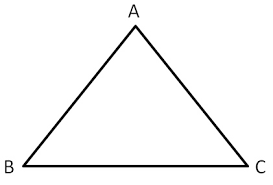

# Triangle Solver

<div align="center">
  
</div>

> **Calculate every side and angle of a triangle with a simple GUI application**
> *Python · Tkinter · Turtle · Math · 🇦🇿 (Azerbaijani UI)*

---

## Table of Contents

* [About](#about)
* [Screenshots](#screenshots)
* [Installation](#installation)
* [Usage](#usage)
* [Project Structure](#project-structure)
* [Features](#features)
* [Roadmap](#roadmap)
* [Contributing](#contributing)
* [License](#license)

---

## About

This repository contains a Tkinter‑based GUI application for **triangle solving**.
When you provide **any 3 elements** (sides and/or angles), the program will:

* Compute the triangle's area (`S`) using Heron's formula or trigonometric area formulas;
* Find every unknown side and angle;
* Identify the triangle type (isosceles, right‑angled, obtuse, etc.);
* Draw a scaled sketch with the `turtle` module;
* Save the calculation results to a `.txt` file.

The interface is in **Azerbaijani**, making it handy for math teachers and students.

---

## Screenshots

| Window|
| ------------------------------------ |
|  | 

> Store PNG/JPG images in the `assets/` folder so they render directly in the README.

---

## Installation

```bash
# 1. Clone the repo
git clone https://github.com/<your_username>/triangle-solver.git
cd triangle-solver

# 2. (Optional) Create a virtual environment
python -m venv venv
source venv/bin/activate  # Windows: venv\Scripts\activate

# 3. Install dependencies
pip install -r requirements.txt
```

> **Core packages:** `tkinter` (standard), `Pillow` (image support), `turtle` (standard).

Example `requirements.txt`:

```text
pillow>=10.0
```

---

## Usage

```bash
python main.py
```

After the GUI opens:

1. Select a **solution scenario** from the combo box.
2. Enter the **given values** (side/angle).
3. Click **Solve**.
4. Optionally **Draw Sketch** or **Export Results** to a text file.

---

## Project Structure

```
.
├── classes.py               # Triangle class & helpers
├── main.py                  # Tkinter GUI entry point
├── operational_functions.py # Math calculations & turtle sketch
├── rprtdbg.py               # (Future) Debug report utility
├── assets/                  # Images for README & GUI
└── requirements.txt         # Dependency list
```

---

## Features

* **Four input scenarios** (`Combobox`):

  * 3 sides
  * 2 sides + included angle
  * 1 side + two adjacent angles
  * 1 side + altitude
* Automatic **area calculation** (Heron / trigonometry).
* Compute all sides & angles via **Sine/Cosine rules**.
* **Turtle sketch** drawing with scaling.
* **TXT export** for saving reports.
* Simple **debug report** stub (`rprtdbg.py`)—to be extended.

---

## Roadmap

* [ ] Implement full functionality in `rprtdbg.py`
* [ ] Add unit tests with `pytest`
* [ ] Provide English UI localization
* [ ] Publish as a `pip` package

Pull requests are welcome ✨

---

## Contributing

1. **Fork** the repo
2. Create a new **branch**: `git checkout -b feature/something`
3. Make your changes and run `pre‑commit`
4. **Commit**: `git commit -m "Add awesome feature"`
5. **Push**: `git push origin feature/something`
6. Open a **Pull Request**

---

## License

MIT © 2025 [Ramazan Nuhbalayev](mailto:example@example.com)


